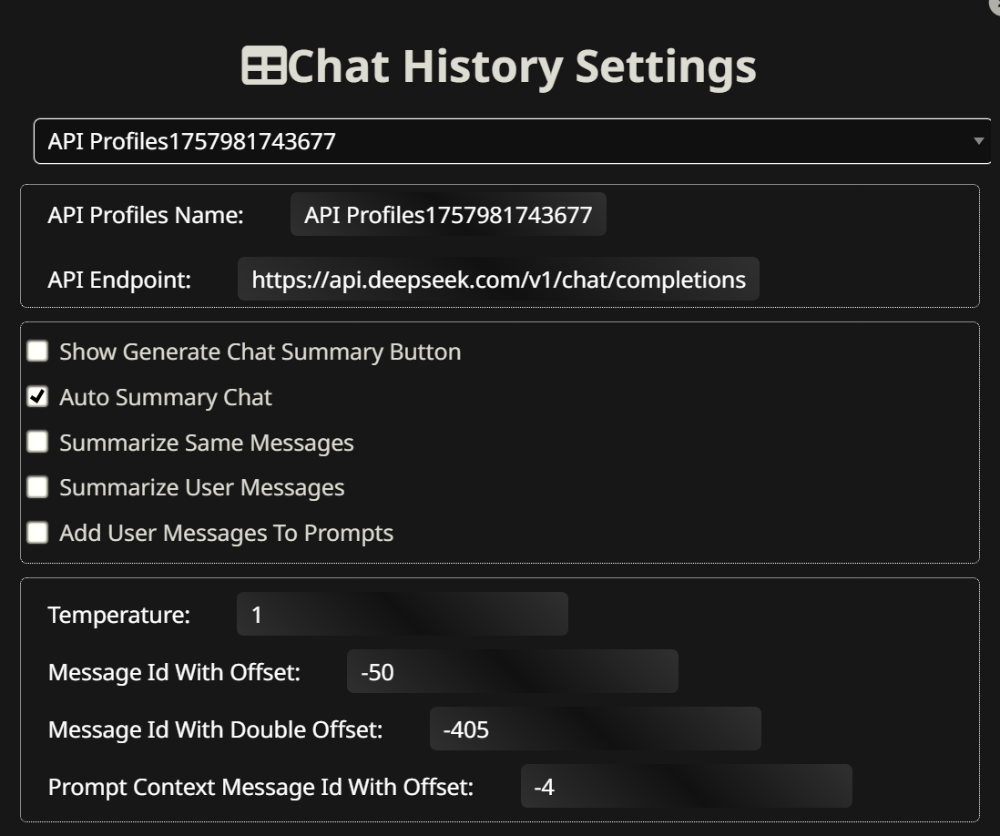
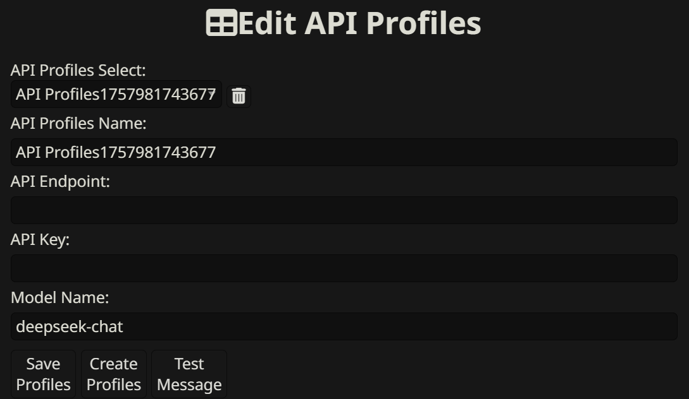
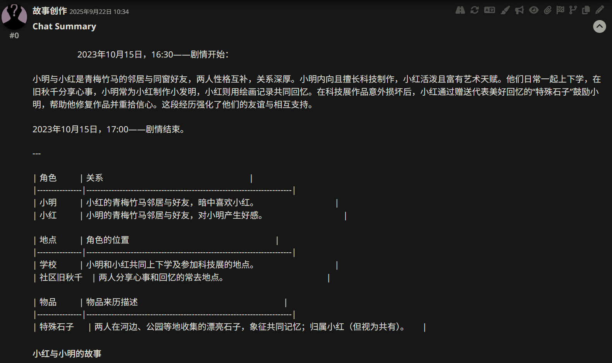
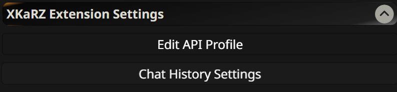

# XKaRZ Extension for SillyTavern

A powerful chat summarization and management extension for SillyTavern that provides automated chat history summarization, API profile management, and enhanced chat navigation features.

## 🌟 Features

### 🤖 AI-Powered Chat Summarization
- **Automated Summarization**: Automatically generate concise summaries of chat conversations using AI models
- **Customizable Templates**: Flexible summary templates with character relationships, locations, and item tracking
- **Selective Processing**: Choose to summarize user messages, AI responses, or both
- **Real-time Processing**: Stream responses with progress tracking and cancellation support

### 🔧 API Management
- **Multiple API Profiles**: Manage different API endpoints and models
- **Easy Configuration**: Simple UI for adding, editing, and testing API connections
- **Secure Storage**: Encrypted API key storage with password fields

### 🎯 Enhanced Chat Navigation
- **Quick Jump**: Jump to specific messages by ID
- **First/Last Message**: Instant navigation to beginning or end of conversations
- **Message Range Processing**: Process specific ranges of messages for summarization

### ⚙️ Advanced Settings
- **Temperature Control**: Adjust AI creativity for summarization
- **Message Offset**: Customize which messages get processed
- **Context Management**: Control how much context is provided to the AI

## 📸 Screenshots

## 🚀 Installation

1. Open Sillytavern.

2. Click on the "Expansion" tab.

3. Using the extension installer, input https://github.com/XKaRZ/Sillytavern-XKaRZ-Extension install.

## ⚙️ Configuration

### Basic Setup
1. **API Configuration**: Set up your preferred AI API (OpenAI, Claude, etc.)
2. **Summary Settings**: Choose which messages to summarize and processing ranges
3. **Template Customization**: Modify the summary template to match your needs

### Advanced Options
- **Message Offsets**: Control how many recent messages to process
- **Temperature**: Adjust AI creativity (0.0-1.0)
- **Context Messages**: Set how many previous messages provide context

## 🎯 Usage

### Automated Summarization
1. Enable "Auto Summary Chat" in settings
2. Conversations will be automatically summarized as they progress
3. Summaries appear as expandable sections below each message

### Manual Summarization
1. Click the "Start Summary" button in the chat interface
2. Use the sync icon on individual messages for targeted summarization
3. Monitor progress with the built-in progress bar

### Navigation
1. Use "firMes" to jump to the first message
2. Use "LastMes" to jump to the most recent message
3. Enter specific message IDs in the input field for precise navigation

## 🔧 API Support

The extension supports any API compatible with the OpenAI chat completion format, including:
- OpenAI GPT models
- Claude models
- Local models (Ollama, LM Studio)
- Other OpenAI-compatible endpoints

## 🐛 Troubleshooting

### Common Issues
1. **API Connection Failed**
   - Check your API endpoint URL
   - Verify API key validity
   - Test connection using "Test Message" button

2. **Summarization Not Working**
   - Ensure sufficient message context is available
   - Check that the selected API model supports chat completion

3. **Performance Issues**
   - Reduce the number of messages processed at once
   - Use faster/smaller models for summarization

---

**Note**: This extension requires SillyTavern to be installed and running. Make sure you have proper API access and credits before using the summarization features.

For support and questions, please open an issue on GitHub or join our community discussions.
